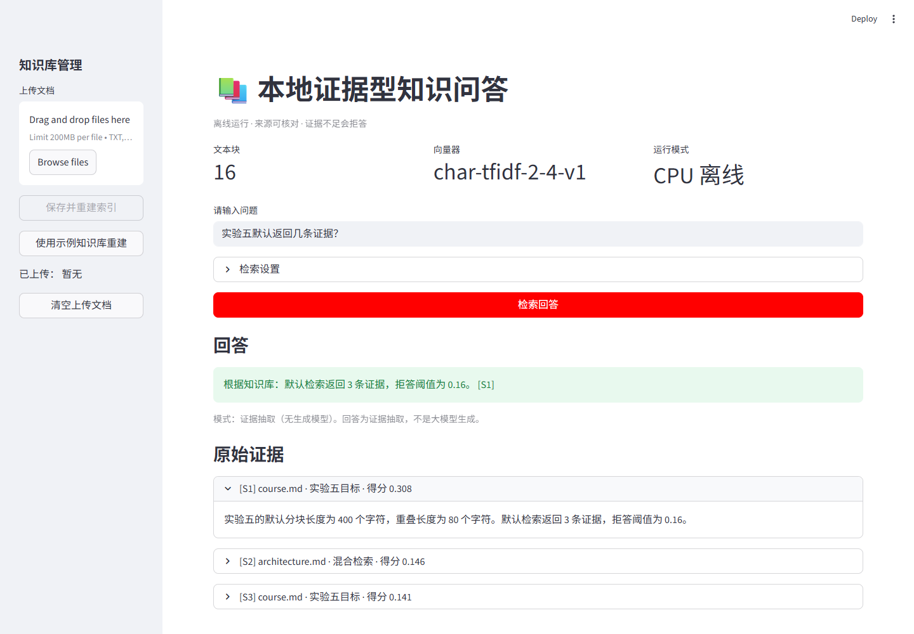
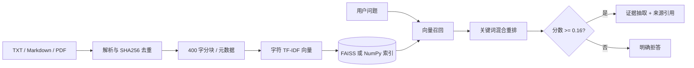

# 实验 5：本地证据型知识问答系统

一个面向课程资料的 CPU 离线 RAG 助手：上传文档后建立持久化索引，回答时展示可核对的原始证据，证据不足则拒答。

作者：侯宇晴（23120506154，软件2304）



## 功能

- 解析 TXT、Markdown 和文本型 PDF；识别空文档、重复文件与需 OCR 的扫描 PDF。
- 按约 400 字、80 字重叠分块，保留文件名、章节、页码、SHA256 文档标识。
- 字符 n-gram TF-IDF 本地向量，优先 FAISS `IndexFlatIP`，安装失败时自动使用 NumPy 精确检索。
- 索引原子写入 `data/index`，重启后直接加载，并校验模型标识、块数和向量数。
- Top-k 混合检索：向量 72% + 关键词 28%，证据低于阈值时拒答。
- 回答和原文分区显示，使用 `[S1]` 来源标记；文档提示注入仅作为不可信文本。
- 无收费 API、无密钥、默认 CPU 运行。

> 当前是明确标注的“证据抽取（无生成模型）”降级模式：直接从命中文本中抽取最相关句子，不把结果冒充大模型生成。可选模型及固定 Revision 见 [models/README.md](models/README.md)。

## 架构



## 环境与安装

- Windows 10/11，Python 3.12
- 建议至少 2 GB 可用内存；示例库实际占用很小
- 首次安装需要网络；运行、索引与问答可断网

```powershell
python --version
python -m venv .venv
.\.venv\Scripts\python.exe -m pip install -r requirements.txt
```

若 `faiss-cpu` 因平台 wheel 或下载问题无法安装，可先移除该行再安装；程序会自动切换到 NumPy 后备，行为和元数据不变。

## 初始化、运行与停止

```powershell
# 运行界面后，在左侧点击“使用示例知识库重建”
.\scripts\start.ps1
# 浏览器访问 http://127.0.0.1:8503
.\scripts\stop.ps1
```

当前仓库已附示例索引的生成材料，但 `data/index` 是运行产物，不提交版本库。命令行重建方式：

```powershell
.\.venv\Scripts\python.exe -c "from pathlib import Path; from src.documents import load_chunks; from src.indexing import LocalIndex; c,_=load_chunks(list(Path('knowledge').glob('*'))); LocalIndex().build(c).save('data/index')"
```

完整 Demo：重建示例库 → 输入“实验五默认返回几条证据？” → 点击“检索回答” → 展开 `[S1]` 核对原文；再问“如何制作番茄炒蛋？”验证拒答。上传文档保存在本机 `data/uploads`，删除后请重建索引。

## 参数与数据 Schema

| 参数 | 默认值 |
|---|---:|
| chunk / overlap | 400 / 80 字符 |
| Top-k / 候选数 | 3 / 12 |
| 拒答阈值 | 0.16 |
| 混合权重 | 向量 0.72 / 关键词 0.28 |
| 向量器标识 | `char-tfidf-2-4-v1` |

块元数据字段：`id`、`doc_id`（SHA256）、`source`、`text`、`section`、`page`。扫描 PDF 不做 OCR，不写入空块。

## 测试与结果

```powershell
.\.venv\Scripts\python.exe -m pytest -q
.\.venv\Scripts\python.exe -m src.evaluate
```

2026-10-01 本机结果：23 项自动化测试全部通过。固定 20 问（16 个库内、4 个域外）结果如下：

| 模式 | Recall@1 | Recall@3 | Recall@5 | 域外误命中率 | 平均延迟 |
|---|---:|---:|---:|---:|---:|
| 纯向量基线 | 93.75% | 100% | 100% | 0% | 0.361 ms |
| 混合检索 | **100%** | 100% | 100% | 0% | 0.613 ms |

逐题 Top-5、10 条回答证据审查、块数和参数保存在 [evaluation/results.json](evaluation/results.json)，测试说明见 [docs/TESTING.md](docs/TESTING.md)。延迟会随机器变化。

## 自主开发与上游差异

本项目未克隆某个现成 RAG 应用，而是依据课程要求独立实现最小系统。自主功能是来源感知混合检索：在向量召回后加入中文双字词覆盖率重排，使同一评测集 Recall@1 从 93.75% 提升至 100%。此外实现了索引一致性校验、NumPy 降级和提示注入告警。

Git 过程采用 `feature/rag-evidence` 分支，提交拆分为初始化、文档索引、检索回答、界面、测试评测与文档；Issue/PR 记录设计和自审。个人自审见 [docs/SELF_REVIEW.md](docs/SELF_REVIEW.md)。

## 安全、隐私与限制

- 文档是不可信输入，系统不执行其中命令，不读取令牌或环境变量回答问题。
- 文件名使用 basename，避免目录穿越；秘密文件和运行索引均由 `.gitignore` 排除。
- 本地处理不等于内容一定正确；引用只能证明“答案来自该片段”，仍需人工核对原文语境。
- 证据抽取不能综合多个片段，也没有生成模型的语言组织能力；TF-IDF 的语义泛化弱于 BGE。
- 极大文件仍可能占用较多内存；生产环境应增加大小限制、鉴权、隔离和审计。
- 删除上传文件后必须重建索引，才能清除旧向量。

## 来源和许可证

项目采用 MIT License。第三方依赖、许可证、示例文档归属见 [NOTICE.md](NOTICE.md)，可选模型及 Revision 见 [models/README.md](models/README.md)。不得把第三方模型权重直接提交到 Git 仓库。

